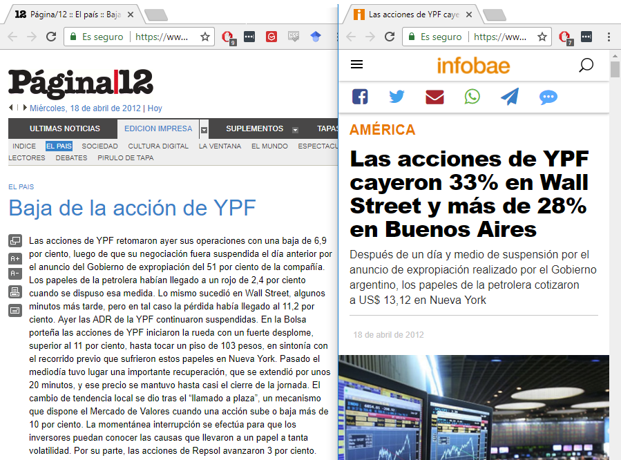

```{r setup, include=FALSE}
knitr::opts_chunk$set(echo = FALSE, message = FALSE, warning = FALSE)
library(quantmod)
library(forecast)
library(xtable)
source("R/plots.R")
```

## Contenido

* Características de una serie de tiempo.
* Conceptos básicos.

## Motivación

\vfill \tiny \metroset{block=fill}
\begin{exampleblock}{\small Discusión en clases}
  ¿Qué entienden por series de tiempo? ¿Pueden nombrar ejemplos?
\end{exampleblock}

## Series de tiempo

> A time series is a set of observations $Z_t$, each one being recorded at a specific time $t$ [@brockwell2016introduction, p. 1].

Objetivos del análisis:

* Descripción e interpretación.
* Inferencia y pruebas de hipótesis.
* Segregación de ruido y señal (*filtering*).

## Ejemplo (1)

\centering

```{r, out.width = "0.9 \\textwidth"}
x <- getSymbols("ARS=X", source = "yahoo", auto.assign = FALSE)

plot_seq(
  Cl(x),
  main = "Divisa ARS:USD",
  ylab = "Cotización al cierre (ARS)",
  xlab = "Tiempo",
  type = 'l', 
  col = 'darkgray', 
  lwd = 1, 
  format.labels = "%m-%y",
  ticks.on = "days"
  )
```

¿Cómo describirían la serie?

## Ejemplo (2)

\centering

```{r, out.width = "0.9 \\textwidth"}
# http://bit.ly/2tVI81B

df <- read.table(
  file = "data//BCRABadlar.txt", 
  header = TRUE,
  sep = "\t", 
  dec = ","
)

df[, 1] <- as.Date(df[, 1], format = "%d/%m/%Y")

x <- xts(df[, -1], df[, 1])

plot_seq(
  x,
  main = "BADLAR en pesos de bancos privados",
  ylab = "Tasa Nominal Anual (%)", 
  xlab = "Tiempo",
  type = 'l', 
  col = 'darkgray', 
  lwd = 1, 
  format.labels = "%m-%y",
  ticks.on = "days"
)
```

¿Observan tendencia?

## Ejemplo (3)

\centering

```{r, out.width = "0.9 \\textwidth"}
# http://bit.ly/2tV4K29

df <- read.table(
  file = "data//cammesaDemanda.txt", 
  header = TRUE,
  sep = "\t", 
  dec = ","
)

df[, 1] <- as.POSIXct(df[, 1], format = "%Y-%m-%d %H:%M:%S")

x <- xts(df[, -1], df[, 1])

plot_seq(
  x[, 1],
  main = "Demanda energética",
  ylab = "Megawatts", 
  xlab = "Tiempo",
  type = 'l',
  col = 'darkgray', 
  lwd = 1, 
  format.labels = "%H:%M:%S",
  ticks.on = "minutes",
  k = 5,
  ylim = c(min(x, na.rm = TRUE), max(x, na.rm = TRUE))
  )

add_lines(x[, 2], col = 2)
add_lines(x[, 3], col = 3)

legend(
  "bottomright",
  legend = c("07/03/2018", "Día anterior", "Semana anterior"),
  lwd = 1,
  col = 1:3,
  bty = "n",
  cex = 0.7
)
```

¿Obsevan estacionalidad?

## Ejemplo (4)

\centering

```{r, out.width = "0.9 \\textwidth"}
x <- na.omit(getSymbols("YPFD.BA", source = "yahoo", auto.assign = FALSE))
r <- na.omit(100 * (Cl(x) / lag(Cl(x)) - 1))

plot_seq(
    r,
    main = "YPFD (BCBA)",
    ylab = "Variación diaria del precio al cierre (%)", 
    xlab = "Tiempo",
    type = 'l', 
    col = 'darkgray', 
    lwd = 1, 
    format.labels = "%m-%y",
    ticks.on = "days"
)
```

¿Obsevan valores atípicos? ¿Observan heterocedasticidad?

## Ejemplo (4 continuación)

\centering

\tiny

```{r}
print(r[index(r)[order(as.numeric(abs(r)), decreasing = TRUE)[1]]])
```

{width = 65%}

## Ejercicio: Producción de gas

\tiny \metroset{block=fill}
\begin{block}{\small Ejercicio en clases}
Describir la serie de tiempo de ejemplo.
\end{block}

\vfill

Además de poner práctica nuestras habilidades para analizar datos reales, el ejercicio nos permite aprender algunas funciones de `R` que son específicas para la manipulación de datos secuenciales. Solución disponible en el anexo.

Algunos pasos:

* Descargar los datos desde https://bit.ly/2GXzXoa.
* De la Sección A 1.25, leer los datos mensuales para la columna *Gas Natural* ^[Hay una copia local en `data/ENARGASGas.txt` en caso de que el sitio esté fuera de línea.].
* Graficar la serie. Describir la serie desde el punto de vista de los componentes estudiados.
* Calcular el promedio de producción anual.

# Anexo: Producción de gas

## Lectura & procesamiento

\centering

\tiny

```{r, echo = TRUE}
# https://bit.ly/2GXzXoa Sección A 1.25
df <- read.table(
  file = "data//ENARGASGas.txt", 
  header = TRUE,
  sep = "\t"
)

df[, 1] <- as.Date(df[, 1], format = "%Y-%m-%d")

z <- xts(x = df[, 2], order.by = df[, 1])
t(head(z, 9))
```

## Visualización

\centering

\tiny

```{r}
plot_seq(
  z,
  ticks.on = "months",
  format.labels = "%m-%y",
  main = expression("Producción de gas natural"), 
  ylab = expression("Millones de " * m^3),
  xlab = expression(t), 
  type = "l",
  col = "darkgray",
  cex = 1,
  cex.axis = 1,
  cex.lab = 1,
  cex.main = 1
  )
```

## Referencias

\tiny
