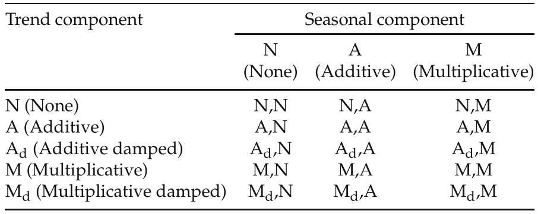
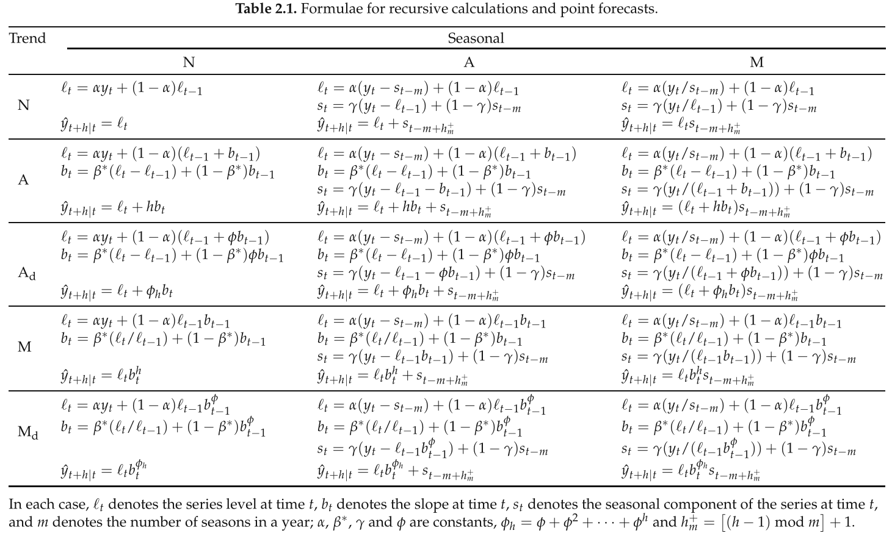
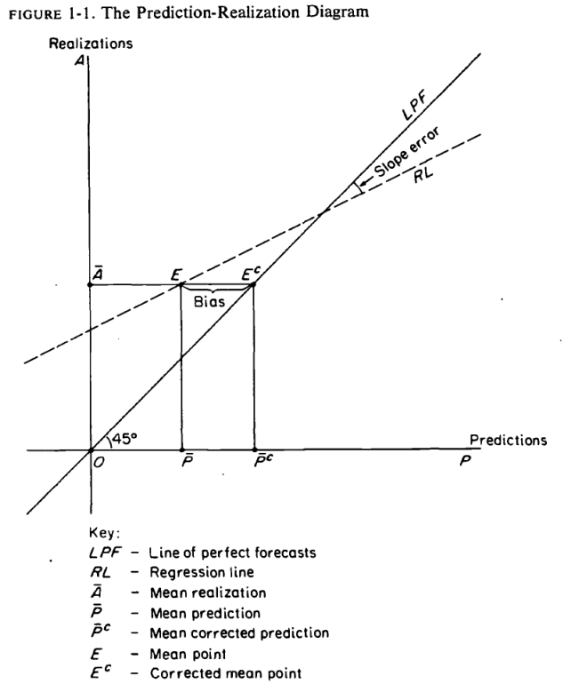

```{r setup, include=FALSE}
knitr::opts_chunk$set(echo = FALSE, message = FALSE, warning = FALSE)
library(quantmod)
library(forecast)
library(xtable)
source("R/plots.R")
```

## Contenido

* Modelos de suavizados exponenciales
* Cálculo de pronósticos
* Selección de modelos
* Ejercicio: Pasajeros en el subterráneo

# Modelos de suavizados exponenciales (en diez minutos)

## Descomposición de series ^[@hyndman2008forecasting]

\ChangeItemFont{\small}{\tiny}{\tiny}

* Elementos:
    * $\mathcal{T}$ Tendencia: Dirección de largo plazo.
    * $\mathcal{S}$ Estacionalidad: Patrón que se repite con una periodicidad conocida.
    * $\mathcal{C}$ Ciclo: Patrón que se repite con una periodicidad desconocida y cambiante.
    * $\mathcal{E}$ Irregular: Parte no predecible (también conocido como residuo, o error).
* Combinación:
    * $\mathcal{N}$ Ninguno: El componente no existe o no es tenido en cuenta.
    * $\mathcal{A}$ Aditiva: Suma de componentes.
    * $\mathcal{M}$ Multiplicativa: Producto de componentes.
    * Pueden aplicarse diferentes operadores para diferentes elementos.

## Tendencia

\centering

\tiny

La tendencia $T_h$ es una combinación de nivel $\ell$ y crecimiento $b$. $0 < \phi < 1$ es el parámetro de *damping*.

* **Sin tendencia**: $T_h = \ell$.
* **Tendencia aditiva**: $T_h = \ell + bh$.
* **Tendencia aditiva con *damping* **: $T_h = \ell + (\phi + \phi^2 + \dots + \phi^h) b$.
* **Tendencia multiplicativa**: $T_h = \ell b^h$.
* **Tendencia multiplicativa con *damping* **: $T_h = \ell b^{(\phi + \phi^2 + \dots + \phi^h)}$.

*Damping*: se cree improbable que la tasa de crecimiento observada hacia el final de la muestra se sostenga en el tiempo.

## Suavizados exponenciales ^[@hyndman2008forecasting]

\centering

\tiny

\


* $N, N$: suavizado exponencial simple.
* $A, N$: modelo lineal de Holt.
* $A, A$: modelo aditivo de Holt-Winters.
* $A, M$: modelo multiplicativo de Holt-Winters.
* Que el error sea aditivo o multiplicativo no afecta los pronósticos puntuales.

## Suavizados exponenciales ^[@hyndman2008forecasting]

\centering

\tiny

\


# Pronósticos

## Ejemplo

\tiny

\centering

```{r, out.width = "0.8 \\textwidth"}
# https://bit.ly/2GXzXoa
df <- read.table(
  file = "data//INDECGaseosas.txt", 
  header = TRUE,
  sep = "\t"
)

df[, 1] <- as.Date(df[, 1], format = "%Y-%m-%d")

z    <- xts(x = df[, 2] / 1000, order.by = df[, 1])
z_ts <- ts(z, frequency = 12, start = 1994) # ets requiere un objeto ts

plot_seq(
  z,
  ticks.on = "months",
  format.labels = "%m-%y",
  main = expression("Ventas de gaseosas"), 
  ylab = expression("Miles de litros"),
  xlab = expression("Tiempo"), 
  type = "l",
  col = "black",
  cex = 1,
  cex.axis = 1,
  cex.lab = 1,
  cex.main = 1
  )
```

\tiny \metroset{block=fill}
\begin{exampleblock}{\small Discusión en clases}
¿Qué familia de modelos ajustarían? ¿Qué características creen importante modelar a los fines del pronóstico?
\end{exampleblock}

## Ajuste

\centering

\tiny

```{r, echo = TRUE}
fit  <- ets(z_ts, lambda = 0)
fit
```

## Pronóstico

\centering

\tiny

```{r, echo = TRUE}
fore <- forecast(fit, h = 12)
fore
```

## Pronóstico

\centering

\tiny

```{r, out.width = "\\textwidth"}
plot(
  fore,
  main = "Pronóstico del modelo ETS(A, N, A)",
  ylab = expression("Miles de litros"),
  xlab = expression("Tiempo"), 
  type = "l",
  col = "black",
  cex = 1,
  cex.axis = 1,
  cex.lab = 1,
  cex.main = 1
)
```

# Evaluación de pronósticos

## Evaluación de pronósticos

Comparar la precisión de diferentes modelos conforma una de las etapas más importantes del proceso de pronóstico.

\small

* Elección de la variable a pronosticar.
* Métrica del error de pronóstico que resulta más relevante para el proceso de selección. Forma de penalizar de pronósticos sub y sobre estimados.
* Criterio de selección de un modelo superior en términos de pronósticos, en especial dado que el error de pronóstico es una variable aleatoria en sí misma.
* Tratamiento de la correlación en el error de pronóstico cuando los parámetros son estimados a partir de conjuntos de datos solapados.

## Función de pérdida

* Idealmente, el proceso de evaluación de pronósticos debe reflejar la utilidad que éstos tienen para el analista.

* Sin embargo, ello requiere un conocimiento preciso del proceso de decisión, incluyendo las funciones de costo y beneficio.

* En consecuencia, casi la totalidad de los trabajos científicos se limitan a aplicar métricas estadísticas.

## Error Medio

\[
  \text{ME} = \frac{1}{T}\sum_{t=1}^{T}{(\volf_t - \volr_t)}
\]

\small

* Mide el desvío promedio.
* Conserva la dirección de los errores, por lo cual también se lo considera una medida del sesgo.
* Dado que las diferencias positivas y negativas pueden cancelarse, cero no indica pronósticos perfectos sino la inexistencia de sesgos.
* Dependiente de la escala de medición y la transformación aplicada.
* Todos los errores son penalizados equitativamente.
* Los valores deseables son cercanos a cero.

## Error Cuadrático Medio

\[
\text{MSE} = \frac{1}{T}\sum_{t=1}^{T}{\left(\volf_t
- \volr_t\right)^2}
\]

\tiny

* Los errores con signo contrario no se cancelan, de forma que el estadístico presenta una medida global del error de pronóstico pero no indica su dirección.
* Al ser una función cuadrática, penaliza los errores más extremos y enfatiza que el error total de pronóstico está afectado ampliablemente por las grandes diferencias individuales.
* Depende de la escala de medición y la transformación aplicada. 
* Su relación con el núcleo de la densidad gaussiana la convierte en una medida útil a pesar de ser poco
intuitiva y difícil de interpretar.
* Esta función de pérdida depende del error de pronóstico, el cual está aproximadamente centrado en cero y tiene una variancia proporcional al cuadrado de la variancia de la variable original.
* Estimador sensible a observaciones extremas.

## Variantes del Error Cuadrático Medio

\[
\text{RMSE} = \sqrt{\frac{1}{T}\sum_{t=1}^{T}{\left(\volf_t -
\volr_t\right)^2}}
\]

* La medición se realiza en la misma unidad que la variable de interés, facilitando su interpretación.

\[
  \text{LMSE} = \frac{1}{T}\sum_{t=1}^{T}{\left(\ln \volf_t - \ln \volr_t\right)^2}.
\]

* Uso de la función logarítmica para disminuir el efecto de valores extremos.

## Error Absoluto Medio

\[
\text{MAE} = \frac{1}{T}\sum_{t=1}^{T}{\left|\volf_t - \volr_t\right|}
\]

\small

* También conocido como desvío absoluto medio.
* Medida de la magnitud global del error de pronóstico. 
* No provee información de la dirección del error pues las diferencias de signo contrario no se cancelan.
* Penaliza todos los errores en proporción a su magnitud.
* Depende de la escala de medición y la transformación aplicada.
* Los valores deseables son cercanos a cero.

## Error Porcentual Absoluto Medio

\[
\text{MAPE} = \frac{1}{T}\sum_{t=1}^{T}{\frac{\left|\volf_t - \volr_t\right|}{\volr_t}}
\]

\small

* Medida relativa.
* Independiente de la escala de medición.
* Afectada por la transformación de los datos.
* No revela información sobre el signo del error.
* Penaliza las diferencias de forma proporcional.

## Razón de aciertos

Las razones de acierto miden la habilidad del pronóstico para anticipar cambios direccionales. 

\tiny

Sean $T^{+}$ y $T^{-}$ la cantidad total de incrementos y decrementos del período fuera de la muestra.

\[
\text{Hit}^{+} = \frac{1}{T^{+}} \sum_{t =
1}{T^{+}}{\ind{(\volf - \volr_t)( \volr_{t+1} - \volr_{t}) >
0} \times \ind{\volr_{t+1} - \volr_{t} > 0}}
\]

\[
\text{Hit}^{-} = \frac{1}{T^{-}} \sum_{t =
1}{T^{-}}{\ind{(\volf - \volr_t)( \volr_{t+1} - \volr_{t}) >
0} \times \ind{\volr_{t+1} - \volr_{t} < 0}}.
\]

\[
\text{MCPDC} = \frac{1}{T} \left( T^{+} \text{Hit}^{+} + T^{-}\text{Hit}^{-} \right).
\]

## Rolling Window

.](img/wf252.png)

## Rolling forecast: Paso 1/3

\centering

\tiny

Crear una función para producir un pronóstico dado una muestra llamada `x`.

```{r, echo = TRUE}
fore1 <- function(x) {
  x_ts <- ts(as.numeric(x), frequency = 12)

  # 1. Ajustar
  fit <- ets(x_ts, lambda = 0)

  # 2. Pronosticar
  fore <- forecast(fit, h = 1)

  # 3. Devolver
  c(fore$lower[2], fore$mean, fore$upper[2])
}

fore1(z["1994/2010"])
```

## Rolling forecast: Paso 2/3

\centering

\tiny

Correr la función para submuestra de tamaño $w = 120$ (diez años).

```{r, echo = TRUE}
w      <- 120 # w ancho de ventana
z_hat1 <- rollapplyr(z, width = w, FUN = fore1)

tail(z_hat1)
```

## Rolling forecast: Paso 3/3

\centering

\tiny

Alinear observación real y pronóstico (generado en el período inmediato anterior).

```{r, echo = TRUE}
z_all1 <- cbind(z, lag(z_hat1, 1))
colnames(z_all1) <- c("Real", "Inferior", "Medio", "Superior")

tail(z_all1)
```

## Ejemplo

```{r, out.width = "\\textwidth"}
plot_seq(
  z_all1[, 1],
  ticks.on = "months",
  format.labels = "%m-%y",
  main = expression("Ventas de gaseosas"), 
  ylab = expression("Miles de litros"),
  xlab = expression("Tiempo"), 
  ylim = c(min(z_all1, na.rm = TRUE), max(z_all1, na.rm = TRUE)),
  type = "l",
  col = "darkgray",
  cex = 1,
  cex.axis = 1,
  cex.lab = 1,
  cex.main = 1
  )

add_lines(z_all1[, 3], col = "blue", lwd = 1)

legend(
  x = "topleft",
  legend = c(
    expression(Z[t]),
    expression(hat(Z)[t] ~ "|" ~ Z[t - 1])
  ),
  col = c("darkgray", "blue"),
  lwd = 1,
  bty = "n",
  cex = 1.5
)
```

## Mincer-Zarnowitz ^[[Ver online](http://www.nber.org/chapters/c1214.pdf).]

\centering

\


## Ejemplo

\centering

\Tiny

\begincols
  \begincol{.48\textwidth}

```{r, echo = TRUE}
lmfit <- lm(
  Real ~ Medio, 
  data = as.data.frame(z_all1)
  )
summary(lmfit)
```

  \endcol
  \begincol{.48\textwidth}

```{r, out.width = "\\textwidth"}
plot_seq(
  z_all1[, 1],
  ticks.on = "months",
  format.labels = "%m-%y",
  main = expression("Ventas de gaseosas"), 
  ylab = expression("Miles de litros"),
  xlab = expression("Tiempo"), 
  ylim = c(min(z_all1, na.rm = TRUE), max(z_all1, na.rm = TRUE)),
  type = "l",
  col = "darkgray",
  cex = 1.5,
  cex.axis = 1.5,
  cex.lab = 1.5,
  cex.main = 2
  )

add_lines(z_all1[, 3], col = "blue", lwd = 1)

legend(
  x = "topleft",
  legend = c(
    expression(Z[t]),
    expression(hat(Z)[t] ~ "|" ~ Z[t - 1])
  ),
  col = c("darkgray", "blue"),
  lwd = 1,
  bty = "n",
  cex = 2
)
```

```{r, out.width = "\\textwidth"}
plot(
  as.matrix(z_all1[, c(3, 1)]),
  xlab = expression(hat(Z)[t] ~ "|" ~ Z[t - 1]),
  ylab = expression(Z[t]),
  pch = 21,
  bg  = "darkgray",
  col = "darkgray",
  cex = 1.5,
  cex.axis = 1.5,
  cex.lab = 1.5,
  asp = 1
)

abline(lmfit)

legend(
  x = "topleft",
  legend = c(
    as.expression(bquote(hat(rho) == ~ .(sprintf("%0.2f", cor(z[-1], z[-length(z)]))))),
    as.expression(bquote(hat(R)^2 == ~ .(sprintf("%0.2f", summary(lmfit)$r.squared))))
  ),
  bty = "n",
  cex = 2
)
```

  \endcol
\endcols

## Ejercicio: Pasajeros en el subterráneo

\tiny \metroset{block=fill}
\begin{block}{\small Ejercicio en clases}
Calcular y analisis los pronósticos de la serie de tiempo de ejemplo.
\end{block}

\vfill

Solución disponible en el anexo.

Algunos pasos:

* Descargar los datos desde https://bit.ly/2GXzXoa.
* De la Sección A 1.10, leer los datos mensuales para la columna *Pasaj. Serv. subterráneos Metrovías SA* ^[Hay una copia local en `data/METROPasajeros.txt` en caso de que el sitio esté fuera de línea.].
* Graficar y describir la serie original. ¿Qué características de la serie parece importante modelar a la hora de pronosticar?
* Proponer un modelo de la familia ARIMA y un modelo de suavizado exponencial.
* Evaluar los pronósticos fuera de la muestra.
* ¿Cómo evaluarían cuál es mejor? Antes que eso... ¿qué entienden por "mejor"?

# Anexo: Pasajeros en el subterráneo

## Lectura & procesamiento

\centering

\tiny

```{r, echo = TRUE}
# https://bit.ly/2GXzXoa
df <- read.table(
  file = "data//METROPasajeros.txt", 
  header = TRUE,
  sep = "\t", 
  dec = ","
)

df[, 1] <- as.Date(df[, 1], format = "%Y-%m-%d")

z <- xts(x = df[, 2] / 1000, order.by = df[, 1])
z_ts <- ts(z, frequency = 12) # stl requiere un objeto del tipo ts

t(head(z, 9))
```

## Visualización

\centering

\tiny

```{r}
plot_seq(
  z,
  ticks.on = "months",
  format.labels = "%m-%y",
  main = expression("Pasajeros en el subterráneo"), 
  ylab = expression("Miles de pasajeros"),
  xlab = expression("Tiempo"), 
  type = "l",
  col = "darkgray",
  cex = 1,
  cex.axis = 1,
  cex.lab = 1,
  cex.main = 1
  )
```

## Serie transformada (ln)

```{r}
tsdisplay(
  log(z),
  main = expression("log" ~ Z_t)
  )
```

## Primera diferencia de la serie transformada (ln)

```{r}
tsdisplay(
  diff(log(z)),
  main = expression(nabla ~ "log" ~ Z_t)
  )
```

## Primera dif. principal y estacional de la serie transformada (ln)

```{r}
tsdisplay(
  diff(diff(log(z)), 12),
  main = expression(nabla ~ nabla^12 ~ "log" ~ Z_t)
  )
```

## Ajuste (1)

\centering

\tiny

```{r, echo = TRUE}
fore1 <- function(x) {
  # 1. Ajustar
  fit  <- Arima(
    x,
    order = c(1, 1, 0),
    seasonal = list(order = c(0, 1, 1), period = 12),
    include.mean = FALSE,
    include.drift = FALSE,
    lambda = 0
  )

  # 2. Pronosticar
  fore <- forecast(fit, h = 1)

  # 3. Devolver
  c(fore$lower[2], fore$mean, fore$upper[2])
}
```

## Ajuste (2)

\centering

\tiny

```{r, echo = TRUE}
fore2 <- function(x) {
  # 1. Ajustar
  fit  <- Arima(
    x,
    order = c(1, 1, 0),
    seasonal = list(order = c(2, 1, 0), period = 12),
    include.mean = FALSE,
    include.drift = FALSE,
    lambda = 0
  )

  # 2. Pronosticar
  fore <- forecast(fit, h = 1)

  # 3. Devolver
  c(fore$lower[2], fore$mean, fore$upper[2])
}
```

## Ajuste (3)

\centering

\tiny

```{r, echo = TRUE}
fore3 <- function(x) {
  x_ts <- ts(as.numeric(x), frequency = 12)

  # 1. Ajustar
  fit  <- ets(x_ts, model = "MAM") # Holt-Winters Multiplicativo

  # 2. Pronosticar
  fore <- forecast(fit, h = 1)

  # 3. Devolver
  c(fore$lower[2], fore$mean, fore$upper[2])
}
```

## Pronósticos

\centering

\tiny

```{r, echo = TRUE}
w      <- 120 # w ancho de ventana
z_hat1 <- rollapplyr(z, width = w, FUN = fore1)
z_hat2 <- rollapplyr(z, width = w, FUN = fore2)
z_hat3 <- rollapplyr(z, width = w, FUN = fore3)

z_all1 <- cbind(z, lag(z_hat1[, 2], 1), lag(z_hat2[, 2], 1), lag(z_hat3[, 2], 1))
z_all1 <- na.omit(z_all1)
colnames(z_all1) <- c("Real", "Modelo 1", "Modelo 2", "Modelo 3")

tail(z_all1)
```

## Pronóstico versus observado (1)

\centering

\tiny

```{r, out.width = "\\textwidth"}
plot_seq(
  z_all1[, 1],
  ticks.on = "months",
  format.labels = "%m-%y",
  main = expression("Pasajeros en el subterráneo"), 
  ylab = expression("Miles de pasajeros"),
  xlab = expression("Tiempo"), 
  ylim = c(min(z_all1, na.rm = TRUE), max(z_all1, na.rm = TRUE)),
  type = "l",
  col = "darkgray",
  cex = 1,
  cex.axis = 1,
  cex.lab = 1,
  cex.main = 1
  )

for (i in 2:4) {
  add_lines(z_all1[, i], col = i, lty = i, lwd = 1)
}

legend(
  x = "topleft",
  legend = c(
    expression(Z[t]),
    expression(hat(Z)[t] ~ "|" ~ Z[t - 1] ~ "Modelo 1"),
    expression(hat(Z)[t] ~ "|" ~ Z[t - 1] ~ "Modelo 2"),
    expression(hat(Z)[t] ~ "|" ~ Z[t - 1] ~ "Modelo 3")
  ),
  col = c("darkgray", 2:4),
  lty = c(1, 2:4),
  lwd = 1,
  bty = "n",
  cex = 1
)
```

## Pronóstico versus observado (2)

\centering

\tiny

```{r, out.width = "\\textwidth"}
pairs_cor2col <- function(x) {
  p <- 0.5 + x / 2
  adjustcolor(rgb(colorRamp(
    c("red", "white", rgb( 46/255, 161/255,  71/255))
    )(p) / 255), alpha.f = 0.5)
}

pairs_upper <- function(x, y, col, ...) {
  points(x, y, pch = 21, col = col, bg = col)

  lines(lowess(x, y), col = 'gray', lwd = 2)
  
  abline(lm(y ~ x), col = "black")
}

pairs_lower <- function(x, y, ...) {
  rect(
   par("usr")[1], par("usr")[3],
   par("usr")[2], par("usr")[4],
   col = pairs_cor2col(cor(x, y))
   )
  
  text(
    x = par("usr")[1] + (par("usr")[2] - par("usr")[1]) / 2,
    y = par("usr")[3] + (par("usr")[4] - par("usr")[3]) / 2,
    cex = 1,
    labels =
      bquote(
        atop(
          hat(rho) == .(sprintf("%0.2f", cor(x, y))),
          hat(R)^2 ~ "=" ~ .(sprintf("%0.2f", cor(x, y)^2))
          )
        )
    )
}

dataset <- as.matrix(na.omit(z_all1))

pairs(dataset, lower.panel = pairs_lower, upper.panel = pairs_upper, col = "darkgray")
```

## Selección de modelo (dentro de la muestra)

\centering

\tiny

```{r, echo = TRUE}
fit1 <- Arima(z,
  order = c(1, 1, 0),
  seasonal = list(order = c(0, 1, 1), period = 12),
  include.mean = FALSE, include.drift = FALSE,
  lambda = 0
)
fit2 <- Arima(z,
  order = c(1, 1, 0),
  seasonal = list(order = c(2, 0, 0), period = 12),
  include.mean = FALSE, include.drift = FALSE,
  lambda = 0
)
fit3  <- ets(z_ts, model = "MAM")
cbind(
  SD = sqrt(c(fit1$sigma2, fit2$sigma2, fit3$sigma2)),
  AIC(fit1, fit2, fit3),
  BIC(fit1, fit2, fit3),
  AICc = c(fit1$aicc, fit2$aicc, fit3$aicc)
)
```

## Selección de modelo (fuera de la muestra)

\centering

\tiny

```{r, echo = TRUE}
MSE  <- function(fore, real) { mean((fore - real)^2) }
RMSE <- function(fore, real) { sqrt(MSE(fore, real)) }
MAE  <- function(fore, real) { mean(abs(fore - real))}
MAPE <- function(fore, real) { mean(abs(fore - real) / real) }
MZR2 <- function(fore, real) { summary(lm(real ~ fore))$r.squared }
MSE(z_all1[, 2], z_all1[, 1]) # Modelo 1 (columna 2) vs. real (columna 1)
RMSE(z_all1[, 2], z_all1[, 1])
MAE(z_all1[, 2], z_all1[, 1])
MAPE(z_all1[, 2], z_all1[, 1])
MZR2(z_all1[, 2], z_all1[, 1])
```

## Selección de modelo

\centering

\tiny

```{r, results = 'asis'}
tab <-
  cbind(
    sapply(
        list(fit1, fit2, fit3), 
        function(x) { sqrt(x$sigma2) }
    ),
    AIC(fit1, fit2, fit3)[, 2],
    BIC(fit1, fit2, fit3)[, 2],
    sapply(
        list(fit1, fit2, fit3), 
        function(x) { x$aicc }
    ),
    t(
      sapply(
        z_all1[, -1], 
        function(fore) {
          c(
            MSE(fore, z_all1[, 1]),
            RMSE(fore, z_all1[, 1]),
            MAE(fore, z_all1[, 1]),
            100 * MAPE(fore, z_all1[, 1]),
            MZR2(fore, z_all1[, 1])
          )
        }
      )
    )
  )

colnames(tab) <- c("SD", "AIC", "BIC", "AICc", "MSE", "RMSE", "MAE", "MAPE", "MZR2")

print(
  xtable(tab, digits = 2, align = rep("r", ncol(tab) + 1)),
  booktabs = TRUE,
  hline.after = c(-1, 0, nrow(tab)),
  scalebox = 1.0,
  comment = FALSE
)
```

## Modelo seleccionado

\centering

\tiny

```{r, out.width = "\\textwidth"}
z_ts <- ts(as.numeric(z), frequency = 12)
fit  <- ets(z_ts, model = "MAM")
fore <- forecast(fit, h = 12)

plot(
  fore,
  main = expression("Pasajeros en el subterráneo"), 
  ylab = expression("Miles de pasajeros"),
  xlab = expression("Tiempo"), 
  type = "l",
  col = "darkgray",
  cex = 1,
  cex.axis = 1,
  cex.lab = 1,
  cex.main = 1
)
```

## Referencias
